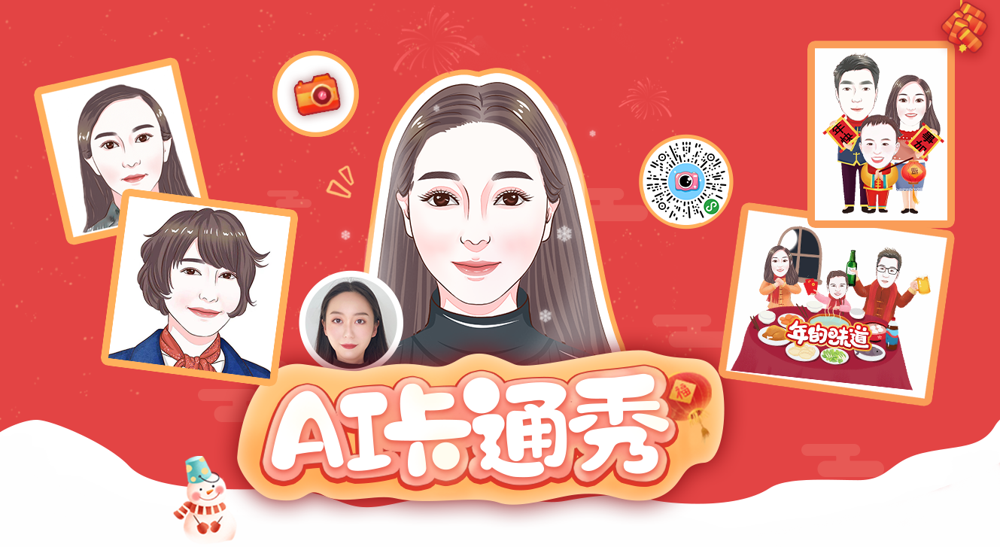
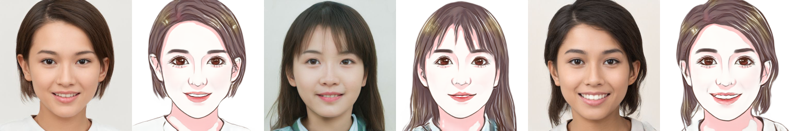

<div align='center'>
  
</div>

# 人像卡通化 (Photo to Cartoon)

**中文版** | [English Version](README_EN.md)

该项目为[小视科技](https://www.minivision.cn/)卡通肖像探索项目。您可使用微信扫描下方二维码或搜索“AI卡通秀”小程序体验卡通化效果。

<div>
  
</div>

也可以前往我们的ai开放平台进行在线体验：[https://ai.minivision.cn/#/coreability/cartoon](https://ai.minivision.cn/#/coreability/cartoon)

技术交流QQ群：937627932

**Updates**
- `2021.12.2`: [在Replicate平台体验](https://beta.replicate.ai/hao-qiang/photo2cartoon)
- `2020.12.2`: 开源基于paddlepaddle的项目[photo2cartoon-paddle](https://github.com/minivision-ai/photo2cartoon-paddle)。
- `2020.12.1`: 增加onnx测试模型, 详情请见 [test_onnx.py](./test_onnx.py)。

## 简介
人像卡通风格渲染的目标是，在保持原图像ID信息和纹理细节的同时，将真实照片转换为卡通风格的非真实感图像。我们的思路是，从大量照片/卡通数据中习得照片到卡通画的映射。一般而言，基于成对数据的pix2pix方法能达到较好的图像转换效果，但本任务的输入输出轮廓并非一一对应，例如卡通风格的眼睛更大、下巴更瘦；且成对的数据绘制难度大、成本较高，因此我们采用unpaired image translation方法来实现。

Unpaired image translation流派最经典方法是CycleGAN，但原始CycleGAN的生成结果往往存在较为明显的伪影且不稳定。近期的论文U-GAT-IT提出了一种归一化方法——AdaLIN，能够自动调节Instance Norm和Layer Norm的比重，再结合attention机制能够实现精美的人像日漫风格转换。

与夸张的日漫风不同，我们的卡通风格更偏写实，要求既有卡通画的简洁Q萌，又有明确的身份信息。为此我们增加了Face ID Loss，使用预训练的人脸识别模型提取照片和卡通画的ID特征，通过余弦距离来约束生成的卡通画。

此外，我们提出了一种Soft-AdaLIN（Soft Adaptive Layer-Instance Normalization）归一化方法，在反规范化时将编码器的均值方差（照片特征）与解码器的均值方差（卡通特征）相融合。

模型结构方面，在U-GAT-IT的基础上，我们在编码器之前和解码器之后各增加了2个hourglass模块，渐进地提升模型特征抽象和重建能力。

由于实验数据较为匮乏，为了降低训练难度，我们将数据处理成固定的模式。首先检测图像中的人脸及关键点，根据人脸关键点旋转校正图像，并按统一标准裁剪，再将裁剪后的头像输入人像分割模型去除背景。

<div align='center'>
  
</div>

## Start

### 安装依赖库
项目所需的主要依赖库如下：
- python 3.6
- pytorch 1.4
- tensorflow-gpu 1.14
- face-alignment
- dlib
- onnxruntime

### Clone：
```
git clone https://github.com/minivision-ai/photo2cartoon.git
cd ./photo2cartoon
```

### 下载资源
[谷歌网盘](https://drive.google.com/open?id=1lsQS8hOCquMFKJFhK_z-n03ixWGkjT2P) | [百度网盘](https://pan.baidu.com/s/1MsT3-He3UGipKhUi4OcCJw) 提取码:y2ch

1. 人像卡通化预训练模型：photo2cartoon_weights.pt(20200504更新)，存放在`models`路径下。
2. 头像分割模型：seg_model_384.pb，存放在`utils`路径下。
3. 人脸识别预训练模型：model_mobilefacenet.pth，存放在`models`路径下。（From: [InsightFace_Pytorch](https://github.com/TreB1eN/InsightFace_Pytorch)）
4. 卡通画开源数据：`cartoon_data`，包含`trainB`和`testB`。
5. 人像卡通化onnx模型：photo2cartoon_weights.onnx [谷歌网盘](https://drive.google.com/file/d/1PhwKDUhiq8p-UqrfHCqj257QnqBWD523/view?usp=sharing)，存放在`models`路径下。

### 测试
将一张测试照片（亚洲年轻女性）转换为卡通风格：
```
python test.py --photo_path ./images/photo_test.jpg --save_path ./images/cartoon_result.png
```

### 测试onnx模型
```
python test_onnx.py --photo_path ./images/photo_test.jpg --save_path ./images/cartoon_result.png
```

### 训练
**1.数据准备**

训练数据包括真实照片和卡通画像，为降低训练复杂度，我们对两类数据进行了如下预处理：
- 检测人脸及关键点。
- 根据关键点旋转校正人脸。
- 将关键点边界框按固定的比例扩张并裁剪出人脸区域。
- 使用人像分割模型将背景置白。

<div align='center'>
  
</div>

我们开源了204张处理后的卡通画数据，您还需准备约1000张人像照片（为匹配卡通数据，尽量使用亚洲年轻女性照片，人脸大小最好超过200x200像素），使用以下命令进行预处理：

```
python data_process.py --data_path YourPhotoFolderPath --save_path YourSaveFolderPath
```

将处理后的数据按照以下层级存放，`trainA`、`testA`中存放照片头像数据，`trainB`、`testB`中存放卡通头像数据。

```
├── dataset
    └── photo2cartoon
        ├── trainA
            ├── xxx.jpg
            ├── yyy.png
            └── ...
        ├── trainB
            ├── zzz.jpg
            ├── www.png
            └── ...
        ├── testA
            ├── aaa.jpg 
            ├── bbb.png
            └── ...
        └── testB
            ├── ccc.jpg 
            ├── ddd.png
            └── ...
```

**2.训练**

重新训练:
```
python train.py --dataset photo2cartoon
```

加载预训练参数:
```
python train.py --dataset photo2cartoon --pretrained_weights models/photo2cartoon_weights.pt
```

多GPU训练(仍建议使用batch_size=1，单卡训练):
```
python train.py --dataset photo2cartoon --batch_size 4 --gpu_ids 0 1 2 3
```

## Q&A
#### Q：为什么开源的卡通化模型与小程序中的效果有差异？

A：开源模型的训练数据收集自互联网，为了得到更加精美的效果，我们在训练小程序中卡通化模型时，采用了定制的卡通画数据（200多张），且增大了输入分辨率。此外，小程序中的人脸特征提取器采用自研的识别模型，效果优于本项目使用的开源识别模型。

#### Q：如何选取效果最好的模型？

A：首先训练模型200k iterations，然后使用FID指标挑选出最优模型，最终挑选出的模型为迭代90k iterations时的模型。

#### Q：关于人脸特征提取模型。

A：实验中我们发现，使用自研的识别模型计算Face ID Loss训练效果远好于使用开源识别模型，若训练效果出现鲁棒性问题，可尝试将Face ID Loss权重置零。

#### Q：人像分割模型是否能用与分割半身像？
A：不能。该模型是针对本项目训练的专用模型，需先裁剪出人脸区域再输入。

## Tips
我们开源的模型是基于亚洲年轻女性训练的，对于其他人群覆盖不足，您可根据使用场景自行收集相应人群的数据进行训练。我们的[开放平台](https://ai.minivision.cn/#/coreability/cartoon)提供了能够覆盖各类人群的卡通化服务，您可前往体验。如有定制卡通风格需求请联系商务:18852075216。

## 参考
U-GAT-IT: Unsupervised Generative Attentional Networks with Adaptive Layer-Instance Normalization for Image-to-Image Translation [[Paper](https://arxiv.org/abs/1907.10830)][[Code](https://github.com/znxlwm/UGATIT-pytorch)]

[InsightFace_Pytorch](https://github.com/TreB1eN/InsightFace_Pytorch)

